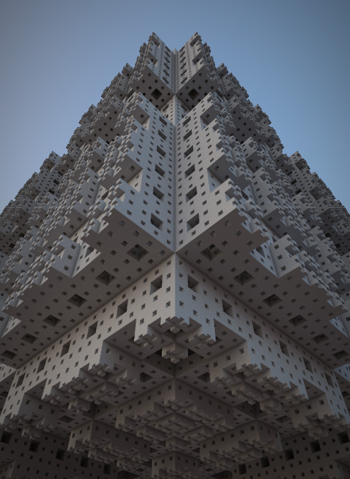
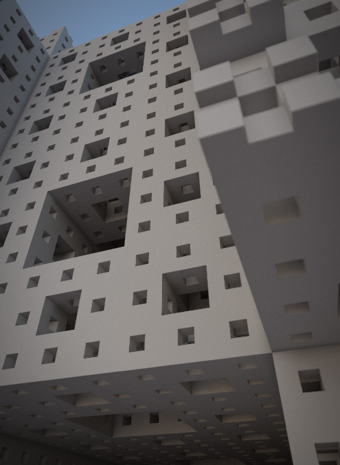
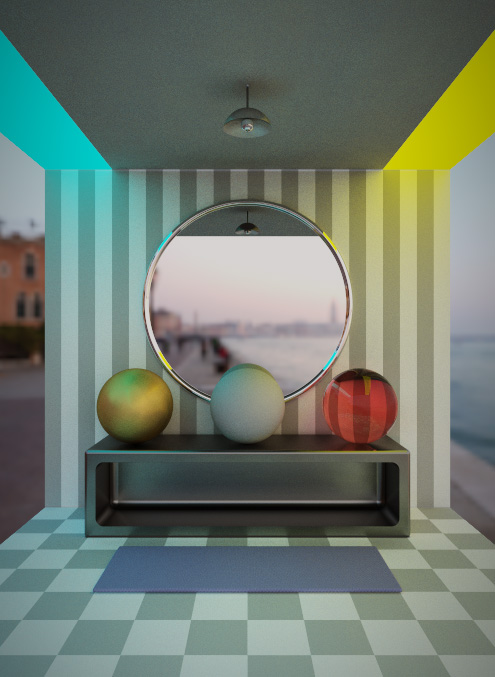
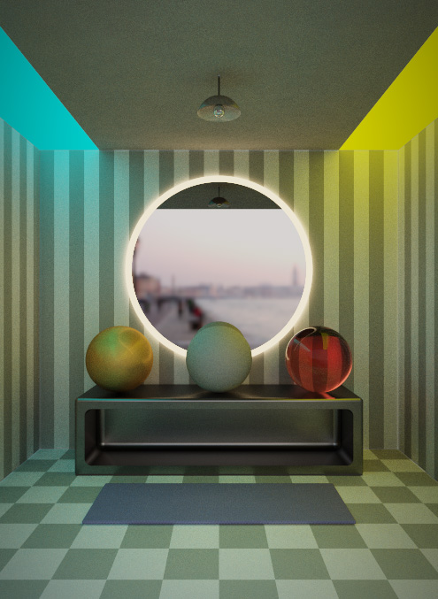
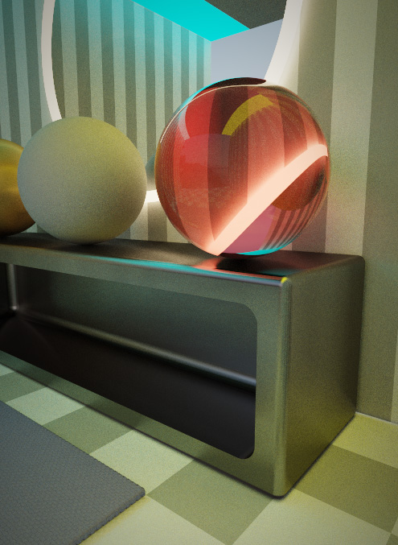
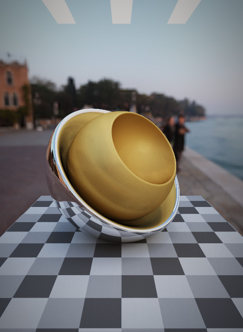
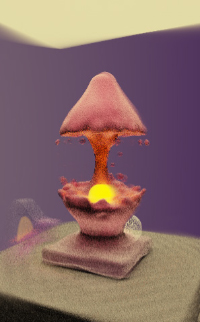

# nRay

Fast raymarched pathtracer 
1.1.5 pre-alpha

[ [Three.js demo](https://nimadez.github.io/nray) ] [ [Babylon.js demo](https://nimadez.github.io/nray/babylon) ]

###### * This demo is in pre-alpha stage and is subject to change

## Features
- SDF raymarching algorithm
- Global illumination, indirect lighting model *(no directional lights)*
- Pathtracing *(basic materials with reflection and refraction)*
- Basic SDF primitives and operators
- HDRI background with image-based lighting *(IBL)*
- Ambient occlusion to bold contact edges
- Blue noise sampling, anti-aliasing, DOF with auto-focus
- Depth, tone mapping, gamma correction and vignette
- User-defined render size and pixel ratio
- Render info and progress bar
- Support file drag and drop *(HDR files)*

##### ***Supported Platforms***
- Google Chrome for desktop *(recommended)*
- Google Chrome for mobile devices *(high-end)*

## Rendered Samples
 
 
 
 
 

*Rendered on GTX-1050-Ti*

## History
*screenshot of the first created image* 

## License
Code released under the [MIT license](https://github.com/nimadez/nray/blob/main/LICENSE).

## Credits
- [Three.js](https://threejs.org/)
- [Babylon.js](https://www.babylonjs.com/)
- [Inigo Quilez](https://www.iquilezles.org/)
- [ShaderToy](https://www.shadertoy.com/)
- [knightcrawler25](https://github.com/knightcrawler25/GLSL-PathTracer)
- [Free blue noise textures](http://momentsingraphics.de/BlueNoise.html)
